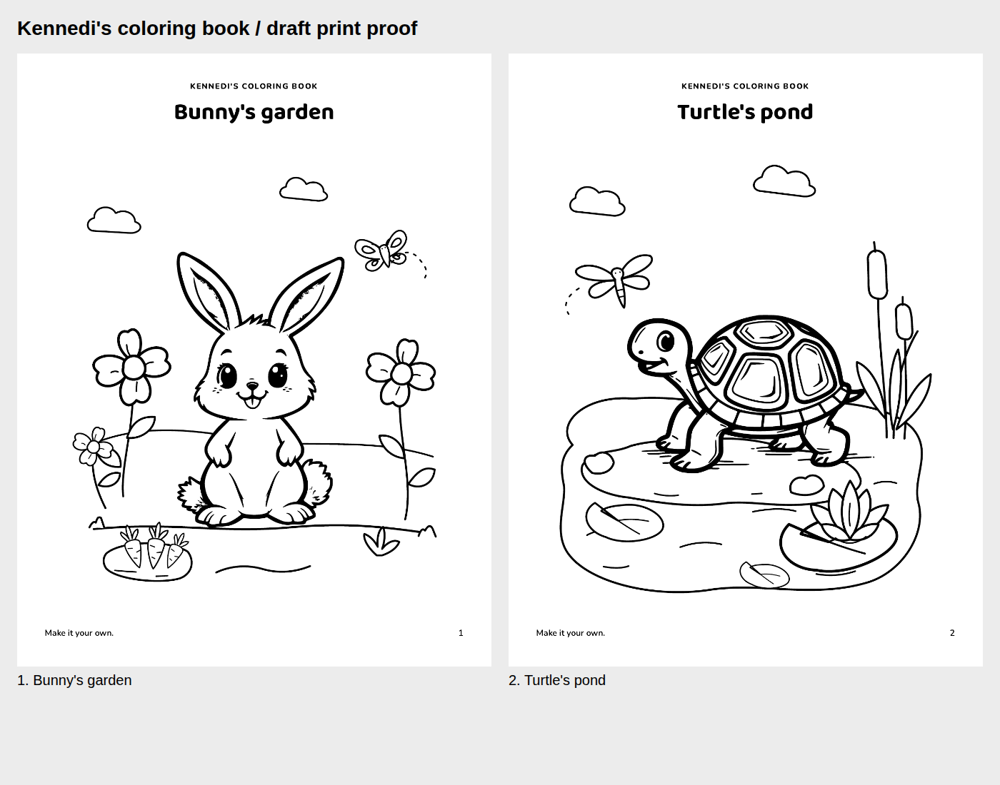

# Owner-approved coloring scenes

Juan visually approved the bunny garden ("Nice") and turtle pond ("love it")
after viewing their grayscale PDF rasters. Approval is for these compositions
and reused art as printed here, not an entire character family or future scenes.
Physical printing remains untested. Canonical animal artwork is unchanged.



[Print both pages](kennedi-coloring.pdf) on US Letter at actual size / 100 percent.
The pair uses the existing quiet typography, broad coloring areas and half-inch
safe margins. Turtle's page number becomes 2 in this pair; its artwork is unchanged.
The generated contact sheet's "draft print proof" heading refers to the generic
proof exporter; current owner visual approval is recorded here and in receipt.json.

## Reproduce

From `workbook/`:

```bash
npm ci
node scripts/workbook.mjs all --recipe recipes/coloring-scenes.json --out dist-recipes/coloring-scenes
npm run coloring:test
```

For an exact reprint with this matching source revision:

```bash
node scripts/workbook.mjs all --recipe docs/art/coloring-approved/recipe.json --out dist-recipes/coloring-scenes-replay
```

`recipe.json` is frozen: source/asset changes fail closed. Use the matching Git
revision for historical reprints, or generate and review a new recipe after an
intentional source change. PDF metadata can vary between builds/browser versions.
`receipt.json` records source/art hashes, exported-file hashes, print verification
and approval scope. No image model or GPU is required to render these pages.

## Editable sources and provenance

Scene layers: `design-source/coloring/scenes/{bunny-garden,turtle-pond}.svg`.
Their linked opaque animal derivatives are in `design-source/coloring/characters/`.
Keep each master beside its relative character link when editing in Inkscape.
Publication replaces those links with inline vector paths, not raster pictures.

Animal raster bases were AI-generated with local FLUX.1-dev. Opaque derivatives
reuse those PNGs with CPU ImageMagick/Potrace settings; no new inference or pose
change. Scenery is assistant-authored, AI-assisted native SVG, not human-drawn.
Original bunny ear/tail trace texture remains inherited. Full provenance is in
`../asset-provenance.md`; historical draft generation receipts remain intact.

Pippa, Kennedi, Unicorn Meadow and Whale Cove are not included in this publication.
